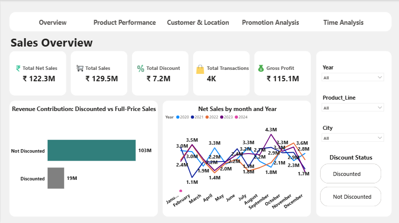
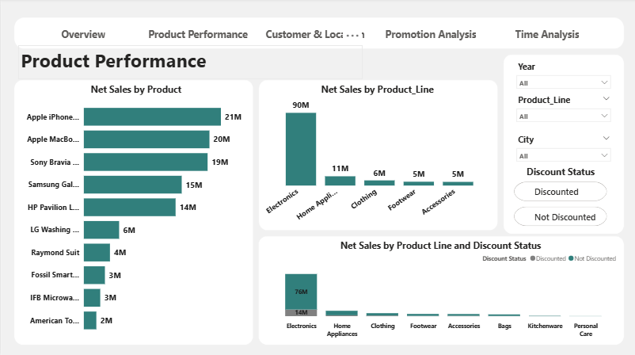
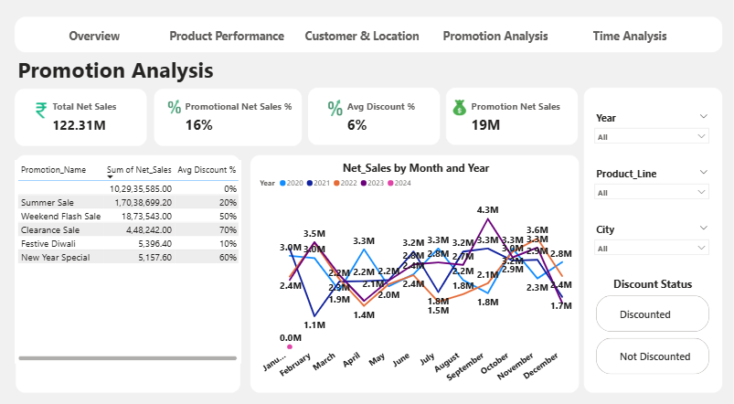

# Retail Sales Analytics Dashboard

## 📊 Project Overview
This project analyzes retail sales performance using **SQL, Python, and Power BI Desktop**.  
The dashboard provides insights into revenue, products, customers, promotions, and time-based trends using an end-to-end business intelligence workflow.

---

## 🧩 Problem Statement
Retail businesses need visibility into:
- Overall sales and profitability
- Product and category performance
- Customer and geographic revenue distribution
- Impact of discounts and promotions
- Monthly and yearly sales trends

This dashboard helps stakeholders make data-driven decisions through structured KPIs and interactive visuals.

---

## 🔄 Workflow & Steps Followed

### Step 1: Data Cleaning & Exploratory Data Analysis (Python)
- Performed EDA to understand data structure and quality.
- Handled missing values and standardized column names.
- Validated pricing, discount, and sales logic.

### Step 2: Data Modeling (Star Schema)
- Designed a star schema with:
  - Fact table: Sales transactions
  - Dimension tables: Product, Customer, Promotion, Time
- Ensured scalable and clean analytical modeling.

### Step 3: SQL Transformations & KPI Creation
- Loaded cleaned data into MySQL.
- Created SQL-based KPIs:
  - Total Sales
  - Net Sales
  - Gross Profit
  - Discount Impact
  - Average Order Value
  - Year-over-Year (YoY) Growth

### Step 4: Power BI Data Modeling
- Imported modeled tables into Power BI Desktop.
- Established relationships using the star schema.
- Validated SQL KPIs against Power BI measures.

### Step 5: Dashboard Development (Power BI Desktop)
- Built a 5-page interactive dashboard:
  - Sales Overview
  - Product Performance
  - Customer & Location Analysis
  - Promotion Analysis
  - Time Analysis
- Added slicers for Year, Product Line, City, and Discount Status.

### Step 6: Final Review & Validation
- Applied a consistent design theme across all pages.
- Verified filtering, navigation, and KPI accuracy.
- Ensured cross-page consistency.

---

## 📄 Dashboard Pages Overview

### Sales Overview
- Executive KPIs: Total Sales, Net Sales, Total Discount, Gross Profit, Transactions
- Discounted vs Non-Discounted revenue contribution
- Monthly Net Sales trends

### Product Performance
- Net Sales by Product and Product Line
- Discounted vs Full-Price sales by category

### Customer & Location Analysis
- Total Customers and Average Revenue per Customer
- City-wise and State-wise Net Sales
- Top customers by revenue

### Promotion Analysis
- Promotion-wise Net Sales
- Average Discount % by promotion
- Promotional vs non-promotional revenue trends

### Time Analysis
- Month-wise and Year-wise Net Sales
- Day-wise sales distribution
- Year-over-Year growth analysis

---

## 📈 Key Insights

### Sales Performance
- Total Net Sales reached **₹122.31M**.
- Majority of revenue comes from non-discounted sales.

### Product Insights
- Revenue is concentrated in specific product lines.
- Some categories depend more on discounts than others.

### Customer & Location Insights
- Sales are geographically concentrated in a few key cities.
- A small group of customers contributes a large share of revenue.

### Promotion Effectiveness
- Promotions contribute a limited but meaningful share of revenue.
- Higher discounts do not always lead to higher sales.

### Seasonal Trends
- Monthly sales show recurring seasonal patterns.
- Sales vary across days of the week.

---

## 🛠️ Tools & Technologies Used
- **SQL (MySQL)** – Data modeling, transformations, KPIs
- **Python** – Data cleaning and EDA
- **Power BI Desktop** – Data modeling, DAX, dashboards

---

## 📸 Dashboard Snapshots

### Sales Overview

### Product Performance

### Customer & Location Analysis

### Promotion Analysis

### Time Analysis

---

## ✅ Project Highlights
- End-to-end analytics workflow
- Star schema data modeling
- Business-focused KPIs
- Multi-page interactive dashboard
- Real-world retail insights
